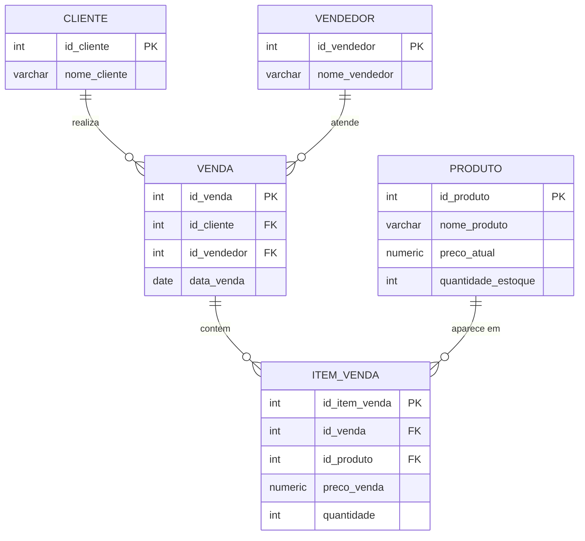

# Análise de vendas com PostgreSQL

Projeto de análise de dados que modela um banco de vendas em PostgreSQL, gera dados simulados com Python e responde perguntas de negócio usando SQL.

> Os dados são **simulados** (gerados por script, com semente fixa), e não representam uma empresa real.

## Perguntas de negócio

- [x] Quais produtos geram mais faturamento?
- [x] Qual o faturamento de cada vendedor?
- [x] Como as vendas evoluem por mês? Existe sazonalidade?
- [x] Qual o ticket médio por venda?
- [x] Quem são os melhores clientes?

## Tecnologias

PostgreSQL 18, Python 3.13 (Faker, pandas, psycopg2), SQL, VS Code, Git.

## Modelo de dados

O banco tem 5 tabelas: `cliente`, `vendedor`, `produto`, `venda` e `item_venda`. O diagrama abaixo também está em [docs/der.md](docs/der.md).



Decisão de modelagem: o `preco_venda` fica em `item_venda`, e não só em `produto`, para preservar o preço praticado em cada venda (descontos, promoções) mesmo que o preço de tabela mude depois.

## Como os dados foram gerados

O script `scripts/gerar_dados.py` cria 500 clientes, 10 vendedores, 15 produtos, 5.000 vendas e cerca de 12.500 itens. Para a análise ter o que mostrar, incluí de propósito:

- sazonalidade: mais vendas em novembro e dezembro;
- vendedores com desempenhos diferentes;
- descontos de 0% a 20% sobre o preço de tabela.

## Resultados

- O Notebook lidera o faturamento, e o Pen drive fica em último.
- Novembro e dezembro vendem quase o dobro dos demais meses, o que reflete a sazonalidade incluída no gerador de dados.
- O ticket médio é de cerca de R$ 2.854 por venda.
- O melhor cliente gastou cerca de 2,8 vezes a média dos clientes. Nos dados simulados, as vendas se distribuem de forma bem igual entre os 500 clientes, então não aparece um grupo de "clientes VIP" como em dados reais.

As consultas completas estão em [sql/02_analises.sql](sql/02_analises.sql).

## Como rodar

```powershell
git clone https://github.com/Lua-Alves/projeto_analise_vendas.git
cd projeto_analise_vendas
python -m venv .venv
.\.venv\Scripts\Activate.ps1
pip install -r requirements.txt
copy .env.example .env
```

Edite o `.env` e coloque a senha do seu PostgreSQL. Depois:

```powershell
psql -U postgres -c "CREATE DATABASE projeto_analise_vendas;"
psql -U postgres -d projeto_analise_vendas -f sql/01_schema.sql
python scripts/gerar_dados.py
psql -U postgres -d projeto_analise_vendas -f sql/02_analises.sql
```

## Estrutura

```
sql/       schema e consultas de análise
scripts/   gerador de dados
docs/      diagrama entidade-relacionamento
```

## O que aprendi de PostgreSQL neste projeto

- **Um servidor, vários bancos.** Sem informar `-d nome_do_banco`, o `psql` conecta no banco padrão `postgres`, e não no do projeto.
- **Paginador do `psql`.** O `-- Mais --` escondia as últimas linhas de um resultado. Resolvi com `\pset pager off`, que vale só para a sessão atual e precisa ser repetido ao abrir o `psql` de novo.
- **Diferença não é tendência.** Dezembro de 2025 teve cerca de 5% mais vendas que dezembro de 2024, mas os meses normais já variam bem mais que isso de um mês para o outro, então não dá para afirmar crescimento.

## Próximos passos

- Analisar o desconto médio por produto (preço praticado × preço de tabela)
- Notebooks em Python com gráficos
- Dashboard