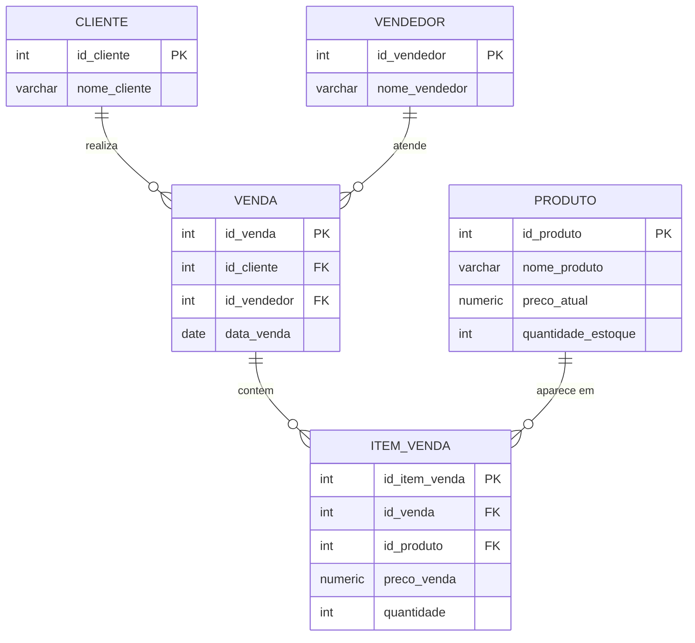

# Diagrama entidade-relacionamento (DER)

```mermaid
erDiagram
    CLIENTE ||--o{ VENDA : realiza
    VENDEDOR ||--o{ VENDA : atende
    VENDA ||--o{ ITEM_VENDA : contem
    PRODUTO ||--o{ ITEM_VENDA : "aparece em"

    CLIENTE {
        int id_cliente PK
        varchar nome_cliente
    }
    PRODUTO {
        int id_produto PK
        varchar nome_produto
        numeric preco_atual
        int quantidade_estoque
    }
    VENDEDOR {
        int id_vendedor PK
        varchar nome_vendedor
    }
    VENDA {
        int id_venda PK
        int id_cliente FK
        int id_vendedor FK
        date data_venda
    }
    ITEM_VENDA {
        int id_item_venda PK
        int id_venda FK
        int id_produto FK
        numeric preco_venda
        int quantidade
    }
```